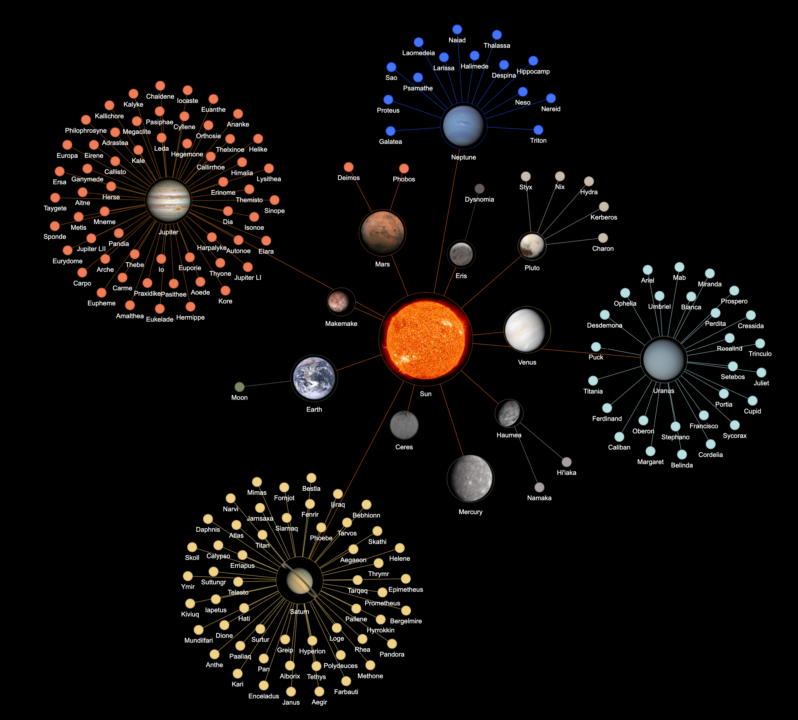

# Solar-System-Network
Visualizes a solar system network with nodes being celestial objects and edges signifying an orbital relationship

The program uses pyvis and networkx to take in a network and display it in this format.